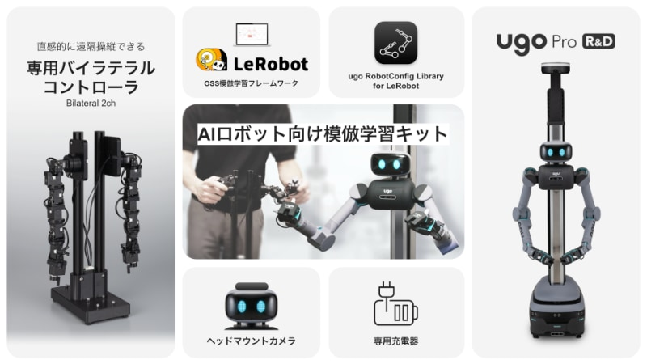

# LeRobot + ugo Pro Integration
[](https://opensource.org/licenses/Apache-2.0)
[](https://github.com/ugo-plus/lerobot-robot-ugo-pro/actions/workflows/ci.yml)



This repository packages a full follower implementation that bridges the [ugo Pro R&D model](https://ugo.plus/products/ugo-pro-rd/) with Hugging Face’s [LeRobot](https://github.com/huggingface/lerobot) ecosystem. It complies with the Bring Your Own Hardware (BYOH) conventions so the robot is autodiscovered by `lerobot-teleoperate`, `lerobot-record`, etc.

Key pieces live under `lerobot_robot_ugo_pro/`:

- `config_ugo_pro.py` — `UgoProConfig`, a BYOH-registered `RobotConfig`.
- `ugo_pro.py` — the `Robot` subclass with lifecycle, observation/action schemas, and safety hooks.
- `telemetry/` — streaming CSV parser (`TelemetryParser`) and `TelemetryFrame` dataclass.
- `transport/` — UDP telemetry listener and command client with a 10 ms rate limiter.
- `follower/mapper.py` — leader→joint mapping with follower gain, mirror, and role support.

Design references, UDP specs, and the end-to-end task plan are documented in `docs/`.

---

## Installation

```bash
pip install lerobot-robot-ugo-pro
# or while developing:
python -m pip install -e ".[dev]"
```

The package exposes the `ugo_pro` robot type via the `lerobot.robots` entry-point, so once installed it is automatically available to the LeRobot CLI tools. When running straight from a git checkout (before packaging), set `PYTHONPATH=$PWD` or `LEROBOT_THIRD_PARTY_MODULES=lerobot_robot_ugo_pro.ugo_pro` so the follower class is importable.

---

## Quick Start

### Teleoperation via CLI

```bash
lerobot-teleoperate \
  --robot.type=ugo_pro \
  --robot.id=my_ugo_pro \
  --teleop.type=ugo_bilcon \
  --teleop.id=my_ugo_bilcon \
  --display_data=true
```

Important flags:

- `--robot.id` ties into LeRobot’s calibration directory; pick a stable identifier per rig.
- Additional robot kwargs (e.g. `--robot.telemetry_host=0.0.0.0`) can be passed to override config fields described below.

### Recording

```bash
lerobot-record \
  --robot.type=ugo_pro \
  --robot.id=my_ugo_pro \
  --robot.cameras="{ front: {type:opencv, index_or_path:2, width:1920, height:1080, fps:15}, left: {type:opencv, index_or_path:1, width:1920, height:1080, fps:15}, right: {type:opencv, index_or_path:0, width:1920, height:1080, fps:15}}" \
  --teleop.type=ugo_bilcon \
  --teleop.id=my_ugo_bilcon \
  --display_data=true \
  --dataset.push_to_hub=false \
  --dataset.repo_id=username/my_record_test \
  --dataset.num_episodes=2 \
  --dataset.single_task="Grab the black cube"
```

### Visualize

```bash
lerobot-dataset-viz \
  --repo-id username/my_record_test \
  --episode-index 0
```

```bash
lerobot-find-cameras

--robot.cameras="{ front: {type: opencv, index_or_path: 2, width: 1920, height: 1080, fps: 15}, left: {type: opencv, index_or_path: 1, width: 1920, height: 1080, fps: 15}, right: {type: opencv, index_or_path: 0, width: 1920, height: 1080, fps: 15}}" \
```

### Replay

```bash
lerobot-replay \
  --robot.type=ugo_pro \
  --robot.id=my_ugo_pro \
  --dataset.repo_id=username/my_record_test \
  --dataset.episode=0
```

### Data visualize

```bash
lerobot-dataset-viz \
  --repo-id=username/my_record_test \
  --episode-index=0
```

### Policy Training

```bash
lerobot-train \
  --dataset.repo_id=${HF_USER}/record-test \
  --policy.type=act \
  --output_dir=outputs/train/policy-test \
  --job_name=policy-test \
  --policy.device=cuda \
  --policy.repo_id=${HF_USER}/policy-test
```

### Python API

```python
from lerobot_robot_ugo_pro import UgoProConfig, UgoPro

config = UgoProConfig(
    telemetry_host="0.0.0.0",
    telemetry_port=8886,
    mcu_host="192.168.4.40",
    command_port=8888,
)
robot = UgoPro(config)
robot.connect()

try:
    obs = robot.get_observation()
    action = {"joint_11.target_deg": 15.0, "mode": "abs"}
    robot.send_action(action)
finally:
    robot.disconnect()
```

`observation_features` / `action_features` are accessible even before `connect()` runs, making the robot compatible with `python -m lerobot.discover`.

---

## Configuration Highlights

`UgoProConfig` exposes the knobs needed to match a particular MCU deployment:

| Field | Description |
| --- | --- |
| `telemetry_host` / `telemetry_port` | UDP bind for incoming MCU telemetry (`8886` by default). |
| `mcu_host` / `command_port` | MCU IP + port for outbound commands (`192.168.4.40:8888`). |
| `left_arm_ids` / `right_arm_ids` | Servo ID ordering (defaults to `[21-28]` for left and `[11-18]` for right). |
| `follower_role` | `"dual"`, `"left-only"`, or `"right-only"` to restrict which arm receives targets. |
| `mirror_mode` | Swap and sign-flip leader actions to mirror across arms. |
| `follower_gain` | Blend factor (0→hold current pose, 1→direct leader tracking, intermediate blends). |
| `action_map` | Map arbitrary leader keys (e.g. `leader.elbow`) to servo IDs. |
| `timeout_sec` | Telemetry timeout; exceeded → automatic `mode:hold` command for fail-safe. |
| `cameras` | Optional `CameraConfig` dict; validated for width/height/fps per BYOH rules. |

Joint limits, default velocity/torque ceilings, and command history depth are also configurable. See `docs/lerobot_ugo_pro_design.md` for the complete field reference and validation rules.

---

## Telemetry & Command Path

- **Telemetry**: `UgoTelemetryClient` binds to `telemetry_port`, decodes CSV packets via `TelemetryParser`, and stores the latest `TelemetryFrame` inside a thread-safe `JointStateBuffer`.
- **Observation**: `UgoPro.get_observation()` translates the frame into per-joint keys (`joint_<id>.pos_deg`, optional `vel_raw`, `cur_raw`, `target_deg`), VSD metadata, status fields, and camera outputs.
- **Action**: `UgoFollowerMapper` normalizes leader input into ordered joint targets (applying mirror mode, follower role, and gain), while `UgoCommandClient` builds the MCU CSV (`cmd/id/tar/spd/trq/sync`) and rate-limits to the configured 10 ms cycle.
- **Fail-safe**: If telemetry stalls beyond `timeout_sec`, the follower automatically sends `mode:hold` with the last safe targets so the MCU freezes posture.

Refer to `docs/ugo_arm_monitoring_spec.md` for the CSV schema, packet cadence, and vsd metadata semantics.

---

## Development & Testing

```bash
git clone https://github.com/ugo-plus/lerobot-robot-ugo-pro.git
cd lerobot-robot-ugo-pro
pip install -e ".[dev]"
pytest
```

Useful commands:

- `pytest` — runs the targeted suites (parser, mapper, config, UDP client, robot tests with dummy transports).
- `mypy lerobot_robot_ugo_pro tests` — type-check runtime + test utilities.
- `ruff check .` / `ruff format .` — linting/formatting.
- `pre-commit install && pre-commit run --all-files` — keep local checks aligned with CI (`.github/workflows/ci.yml` runs ruff + mypy + pytest).

Need reference data while developing? See:

- `docs/custom_robot_integration_with_lerobot.md` — BYOH checklist mirrored from upstream docs.
- `docs/lerobot_ugo_pro_design.md` — architecture decisions and module breakdown.
- `docs/ugo_arm_monitoring_spec.md` — UDP telemetry / command protocol straight from the MCU team.

---

## Support & Future Work

The implementation already covers telemetry parsing, follower mapping, UDP transport, and LeRobot integration. Upcoming work includes feedback channels to teleoperators, dataset tooling, and expanded monitoring hooks. Contributions are welcome—please open an issue or PR if you extend the mapper, transport, or docs for your deployment.
