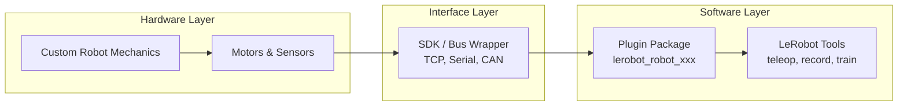
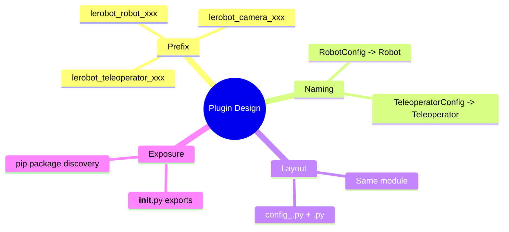
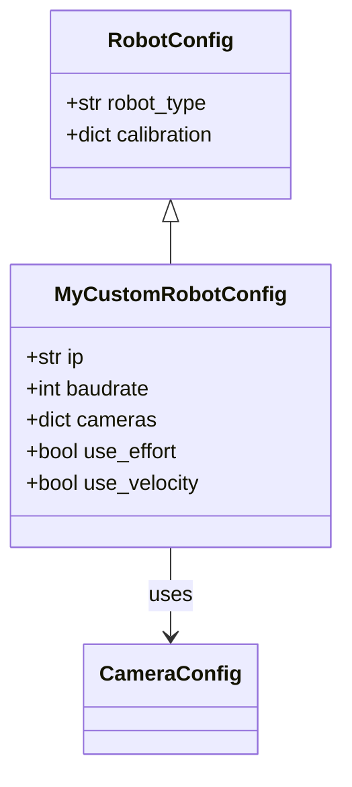
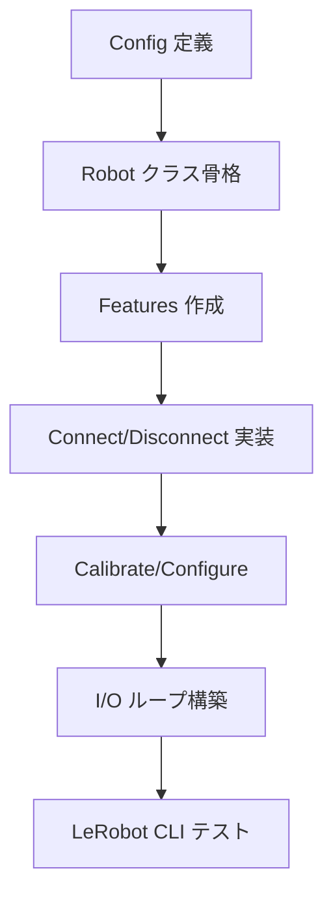
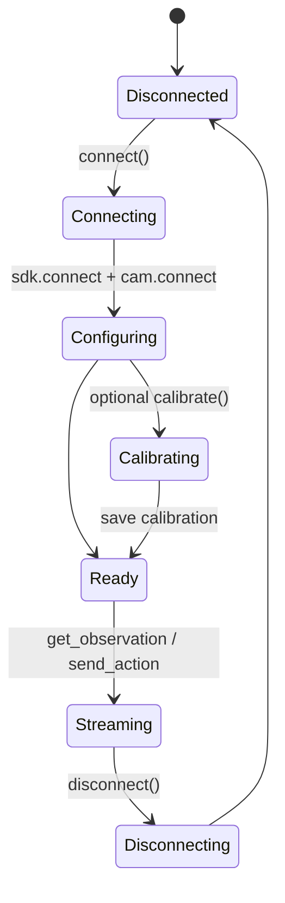
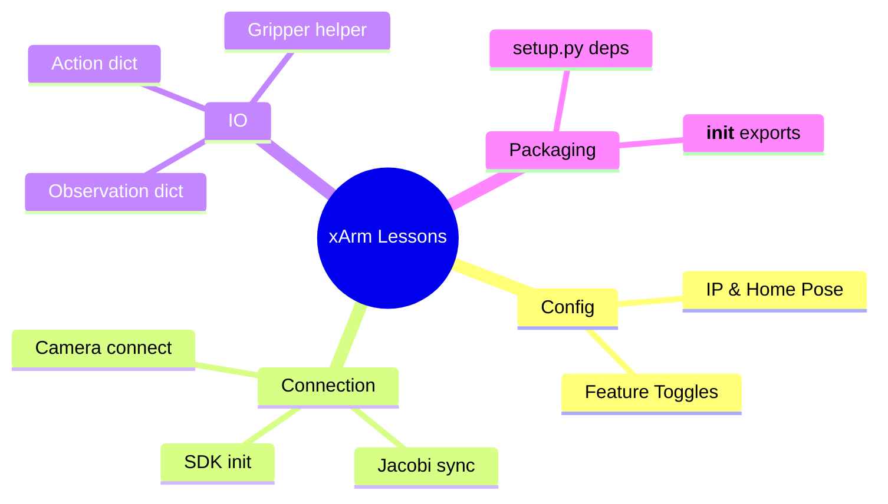
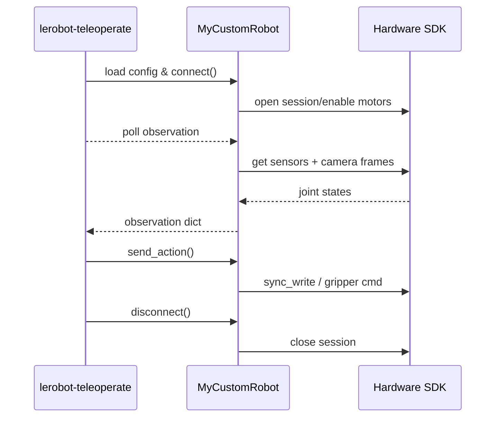

# LeRobot カスタムロボット統合ドキュメント

LeRobot の [`Robot`](https://github.com/huggingface/lerobot/blob/main/src/lerobot/robots/robot.py) 抽象クラスは、任意のロボットを LeRobot ツールチェーン（データ収集、ポリシー学習、推論、テレオペレーション）へ接続するための共通インターフェースを提供します。本書では公式ドキュメント（`refs/lerobot/docs/source/integrate_hardware.mdx`）とコミュニティ実装である [`lerobot-robot-xarm`](https://github.com/SpesRobotics/lerobot-robot-xarm) を踏まえ、`lerobot_robot_xarm` と同程度の完成度で独自ロボットを統合する具体的な手順を整理します。

---

## 1. 事前準備と全体像

- **ハードウェア I/F**: ロボットへコマンドを送信し、センサ値を取得できる SDK / 通信プロトコル（例: TCP、シリアル、CAN）が必要です。  
- **Python 環境**: `lerobot` をインストールし、開発中のパッケージから import 可能にしておきます。  
- **校正データ**: 関節ゼロ点や可動域を保存・再利用できるようにしておくと、LeRobot のキャリブレーション API を活かせます。  
- **付帯デバイス**: カメラやグリッパ等は `Camera`／`MotorsBus`／独自クラスで扱います。

LeRobot には「ハードウェア実装を pip パッケージとして提供すると自動検出される」という仕組みがあり、特別なプラグイン API やコード変更は不要です。



---

## 2. プラグインパッケージの作り方

`refs/lerobot/docs/source/integrate_hardware.mdx` の「4 Core Conventions」を守ると、`lerobot-teleoperate` などの CLI が自動でクラスを見つけます。

1. **パッケージ名の接頭辞**  
   - ロボット用: `lerobot_robot_<name>`  
   - 例: `lerobot_robot_xarm` (`refs/lerobot-robot-xarm-main/setup.py`)
2. **Config／本体クラスの命名ペア**  
   - `MyRobotConfig` ↔ `MyRobot` のように `Config` を外した名前で本体クラスを定義します。
3. **モジュール配置**  
   - Config と本体を同一モジュールか、`config_<name>.py` と `<name>.py` のような分割にします。  
   - xArm 例: `config_xarm.py`, `xarm.py`, `__init__.py`。
4. **`__init__.py` での公開**  
   - `from .config_xarm import XarmConfig` のように re-export しておくと import がシンプルになります。



### `pyproject` / `setup.py`

依存ライブラリ（ハードウェア SDK、数値計算、テレオペ周辺など）は `install_requires` へ記載します。`lerobot_robot_xarm` では以下を指定しています。

```python
install_requires = [
    "xarm-python-sdk",
    "numpy",
    "transforms3d",
    "teleop",
    "lerobot>=0.4",
]
```

---

## 3. `RobotConfig` を定義する

`RobotConfig` は dataclass としてロボット固有の設定値（通信先 IP、使用するセンサ、校正フラグなど）を持ちます。

```python
from dataclasses import dataclass, field
from lerobot.cameras import CameraConfig
from lerobot.robots.config import RobotConfig

@RobotConfig.register_subclass("my_custom_robot")
@dataclass
class MyCustomRobotConfig(RobotConfig):
    ip: str = "192.168.1.10"
    baudrate: int = 2_000_000
    cameras: dict[str, CameraConfig] = field(default_factory=dict)
    use_effort: bool = False
    use_velocity: bool = True
```

ポイント:

- `@RobotConfig.register_subclass("<robot_type>")` の `<robot_type>` が CLI で指定する `--robot.type` になります。
- 複数カメラを扱う場合、`CameraConfig` (例: `OpenCVCameraConfig`) を辞書で持たせて `make_cameras_from_configs()` に渡します。
- xArm では `home_translation` や `home_orientation_euler` など、初期姿勢を `config` に入れて `send_action()` で参照しています (`refs/lerobot-robot-xarm-main/lerobot_robot_xarm/config_xarm.py`)。



---

## 4. `Robot` 実装の 5 ステップ

`integrate_hardware.mdx` で示されているステップに沿って、本体クラスを実装します。



### 4.1 クラスの骨格

```python
from lerobot.robots.robot import Robot
from lerobot.cameras import make_cameras_from_configs

class MyCustomRobot(Robot):
    config_class = MyCustomRobotConfig
    name = "my_custom_robot"

    def __init__(self, config: MyCustomRobotConfig):
        super().__init__(config)
        self.config = config
        self.cameras = make_cameras_from_configs(config.cameras)
        self._bus = None        # 例: シリアル/SDK クライアント
        self._is_connected = False
```

### 4.2 観測／アクションの特徴量

- **`observation_features`**: センサ出力のキーと型（または配列形状）を返す。ハードウェア未接続でも実行可能にしておく。
- **`action_features`**: `send_action()` が受け取る辞書のキーと型を返す。  
- xArm では `joint{i}.pos` に加えて `gripper.pos`、設定フラグに応じて `vel`/`effort`/`acc` を切り替え (`refs/lerobot-robot-xarm-main/lerobot_robot_xarm/xarm.py#L155-L188`)、CLI 側で `robot.use_velocity=false` のようなトグルが可能です。

### 4.3 接続・切断 (`connect` / `disconnect` / `is_connected`)

1. SDK のセッション確立 (`XArmAPI.connect()` など)  
2. モータバスや制御モード設定 (`set_mode`, `motion_enable`)  
3. センサ初期化（例: カメラの `cam.connect()`）  
4. キャリブレーション呼び出し（必要なら）  
5. `self.is_connected = True` で状態を反映

切断ではリソースを逆順に解放し、例外を飲み込まないようにします。xArm 実装ではグリッパ停止→アーム切断→カメラ解放→`is_connected=False` の順 (`xarm.py#L214-L239`)。

### 4.4 キャリブレーションと設定 (`calibrate`, `configure`, `is_calibrated`)

- 校正値が不要な場合もプロパティは実装し、`True` や no-op を返します。  
- Feetech / Dynamixel など同梱バスを使う場合は `MotorCalibration` ヘルパを利用し、`self.calibration` / `_save_calibration()` を更新します。  
- xArm のように外部 SDK が絶対角を返すケースでは `calibrate()` を空にし、`configure()` で初期姿勢を読み取ってログに出すだけでも構いません (`xarm.py#L241-L260`)。

### 4.5 I/O ループ (`get_observation`, `send_action`)

- `get_observation()` は辞書を返し、`observation_features` と同じキー構成にします。  
  - ジョイント角: SDK の `get_joint_states()` 等  
  - 速度/加速度: 前回観測との差分で算出 (`xarm.py#L186-L209`)  
  - カメラ画像: `cam.async_read()`  
- `send_action()` では安全性を確保しながらコマンドを送信します。  
  - xArm 例: エンドエフェクタの `delta_x/y/z` や `delta_roll/pitch/yaw` を受け取ったら URDF ベースの `JacobiRobot` で逆運動学を解き、ジョイント角へ変換 (`xarm.py#L73-L166`)。  
  - `home` コマンドで既定姿勢へ戻す処理や、`gripper.pos` の専用クラス (`Lite6Gripper`) を挟んで状態保持を行っています。

### 4.6 付帯機能

- **URDF / 運動学**: `JacobiRobot` に URDF を読み込ませると `servo_to_pose()` や `get_joint_position()` が使え、テレオペデバイスからの 6DoF 入力を姿勢コマンドに変換できます。  
- **グリッパー**: xArm では SDK が提供する `open_lite6_gripper()` / `close_lite6_gripper()` をラップし、入力が変わった時だけ発火するようにデバウンスしています。  
- **リセット**: `reset()` で外部制御中にグリッパーを初期化できるようにしておくと便利です。



---

## 5. xArm 実装から得られるチェックリスト

| 項目 | 実装例 | ポイント |
| --- | --- | --- |
| パッケージ構成 | `lerobot_robot_xarm/` + `setup.py` | 4 つの規約を満たす |
| Config | `XarmConfig` | IP や可視化フラグ、ホーム姿勢を保持 |
| 接続処理 | `Xarm.connect()` | SDK 初期化→Jacobi へ初期角度を同期→カメラ接続 |
| 観測 | `get_observation()` | 角度・トルク・速度・加速度を一貫したキーで提供 |
| アクション | `send_action()` | 位置指定／差分指定／ホーム復帰／グリッパを統合 |
| キャリブレーション | `configure()` | 初期姿勢ログ、自前キャリブ不要の場合は no-op |
| 公開 | `__init__.py` | Config とクラスを re-export |



---

## 6. テレオペ／CLI からの利用フロー

1. **開発インストール**
   ```bash
   cd lerobot_robot_my_custom
   pip install -e .
   ```
2. **接続テスト**
   ```bash
   lerobot-teleoperate \
       --robot.type=my_custom_robot \
       --robot.ip=192.168.1.10 \
       --teleop.type=keyboard_ee \
       --fps=60
   ```
   - `--robot.type` は `@RobotConfig.register_subclass` で登録した名前。  
   - Config で定義したフィールドはドット記法で CLI 引数として渡せます。
3. **レコーディング / 再生**  
   - `lerobot-record` でデータセット収集、`lerobot-play` で再生。  
   - 観測・アクションのキー名がデータセットの列名となるため、命名は計画的に。



---

## 7. 実装時のチェックポイント

- [ ] `observation_features` / `action_features` がハード未接続でも参照できる  
- [ ] `connect()` で例外が起きたら部分的に接続したデバイスを確実に解放する  
- [ ] `send_action()` は入力をコピーして副作用を避ける (`copy.deepcopy`)  
- [ ] グリッパ等の離散デバイスはクラス化して状態遷移を管理する  
- [ ] URDF・変換行列の単位（ラジアン／メートル）を SDK と揃える  
- [ ] `pip install -e .` 後に `python -m lerobot.discover`（LeRobot 0.4 以降）で認識されるか確認  
- [ ] 観測とアクションのキーが CLI の `--robot.features.*` 設定と一致している  

---

## 8. まとめ

1. `RobotConfig` と `Robot` を実装し、`lerobot_robot_<name>` というパッケージ名で公開する。  
2. `connect` / `disconnect` / `get_observation` / `send_action` / `calibrate` / `configure` をハードウェアに合わせて具体化する。  
3. xArm 実装のように URDF やグリッパヘルパを活用すると、テレオペやポリシー学習時の柔軟性が高まる。  
4. LeRobot CLI から `--robot.type=<name>` で呼び出せる状態まで仕上げれば、他のロボットと同じ UX でデータ収集・制御が可能になる。

これらのステップを辿れば、`lerobot-robot-xarm` と同じパターンで任意のロボットを LeRobot エコシステムに組み込むことができます。