# lerobot_ugo_pro / UgoPro 設計ドキュメント

## 1. 背景と目的

ugo_pro デュアルアームロボットを Hugging Face LeRobot エコシステムへフォロワーロボット（leader-follower）として統合する。ugo Controller MCU から配信される UDP テレメトリ仕様（`ugo_dual_arm/ugo_arm_monitoring_spec.md`）を信頼できる唯一の真実とし、LeRobot の `Robot` 抽象クラスで定義される `connect`/`disconnect`/`get_observation`/`send_action` などの標準コンタクトを満たす Python 実装を提供する。本設計では Bring Your Own Hardware (BYOH) ガイドとコミュニティ実装 `lerobot-robot-xarm` を根拠に、パッケージ化・機能分解・テスト方針を明確化する。

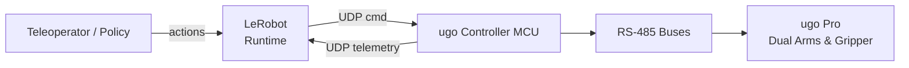

## 2. 参照資料からの要件

### 2.1 Hugging Face BYOH ガイド（Bring Your Own Hardware）

- Robot 実装は `Robot` 抽象クラスを継承し、`RobotConfig` を `@RobotConfig.register_subclass("<plugin_id>")` で登録する。`Robot` 基底クラスは `HF_LEROBOT_CALIBRATION/robots/<name>/<id>.json` に校正ファイルを保存するため、Config 側で `id` と `calibration_dir` を整備しておく。
- `observation_features` と `action_features` は未接続時でも評価可能な静的スキーマを返す必要がある。`custom_robot_integration_with_lerobot.md` で示されたとおり、辞書キーは `get_observation`/`send_action` のキーと 1:1 で対応させ、配列データは `(height, width, channel)` などの shape を返す。
- `connect`/`disconnect` は通信路（UDP ソケット、カメラ、スレッド）を安全に開閉し、必要なキャリブレーション・コンフィグレーションを同メソッド内で完結させる。xArm 実装同様 `DeviceAlreadyConnectedError`/`DeviceNotConnectedError` を活用する。
- `is_calibrated`/`calibrate`/`configure` を通じてキャリブレーションや機体固有設定を管理する。未対応の場合は明示的に no-op にするが、`Robot` 基底クラスの `_load/_save_calibration` を活用すれば後から差し替えやすい。
- `get_observation`/`send_action` は入出力を辞書形式で扱い、LeRobot の各 CLI（`lerobot-teleop`, `lerobot-record` など）で自動発見されるよう、パッケージ命名とエクスポート規約を守る必要がある。BYOH ガイドの 4 ルール（`lerobot_robot_*` 接頭辞、`FooConfig/Foo` ペア、モジュール配置、`__init__.py` での公開）と `pyproject` の `entry-points."lerobot.robots"` を満たすことで、自動ディスカバリに乗る。
- Teleoperator 実装や追加デバイスも同様の規約で別パッケージ化すれば CLI から自動検出できる。`lerobot` 側ではモジュールを import した上で `RobotConfig.register_subclass` を探索するため、`pip install -e .` 済みの環境に配置する。

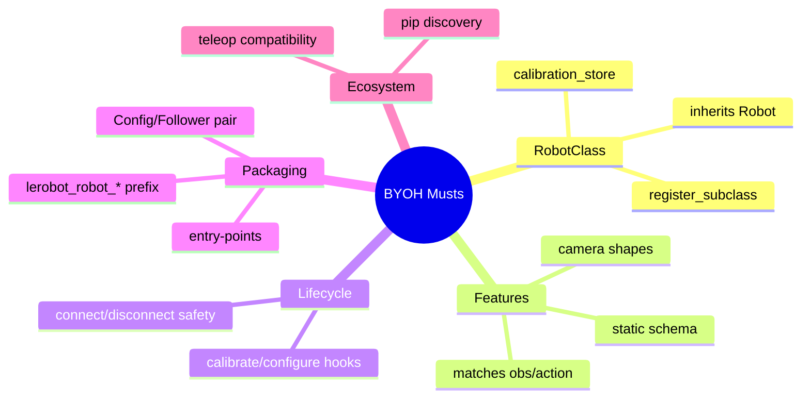

### 2.2 サンプル実装 `lerobot-robot-xarm`

- `lerobot_robot_xarm` は `RobotConfig` + `Robot` クラスを同パッケージ内で公開し、`pyproject`（または `setup.py`）に `lerobot` を依存関係として記述している。
- `observation_features`/`action_features` ではジョイント名（例: `joint{i}.pos`）やカメラ出力の shape を静的辞書で表し、Config のフラグで effort/velocity/acceleration を切り替える作りになっている。
- `connect` 時にハードウェア SDK（`XArmAPI`）を初期化し、センサー/モータ/カメラをまとめて接続。`disconnect` では逆順で安全に解放している。
- 行動送信は SDK の API 呼び出し前に辞書を正規化する（位置指令へ変換、欠損キー補完など）。観測取得では直近値を保持して速度・加速度を計算している。
- 上記の実装パターンを `ugo_pro` でも踏襲することで、LeRobot CLI から `--robot.type=lerobot_robot_ugo_pro` といった形で自動検出させられる。

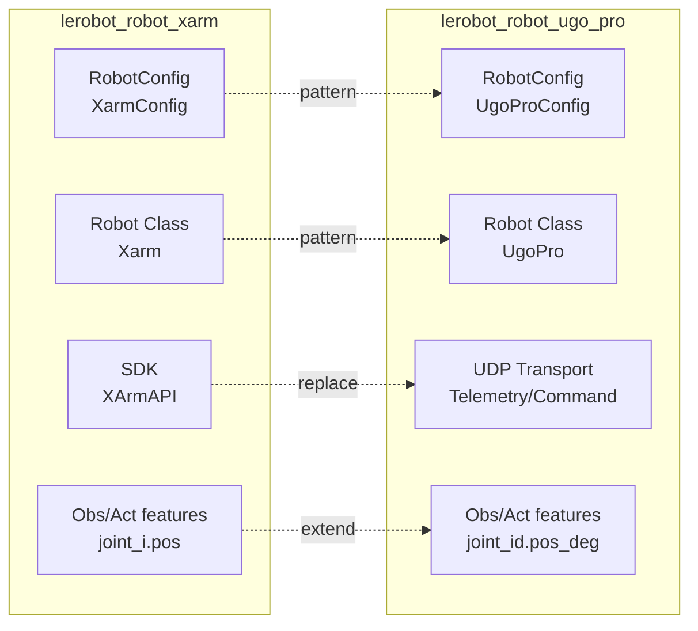

### 2.3 `ugo_arm_monitoring_spec.md`

- MCU → PC の UDP テレメトリは 10 ms 周期で `vsd`, `id`, `agl`, `vel`, `cur`, `onj_agl` 行を CSV で送信。ジョイント ID は左腕（11–17）/右腕（1–7）の順で送られ、角度は 0.1 度単位。
- PC → MCU のコマンドも CSV で `cmd`/`id`/`tar`/`spd`/`trq`/`sync` を送信し、絶対角モード (`mode:abs`) を基本とする。送信角度は 0.1 度単位の整数。
- UDP 通信パラメータは MCU `192.168.4.40:8888`、PC 受信 `192.168.4.10:8886`。双方向通信を保ちつつ 30 ms 以上欠損したら hold に入る推奨運用が定義されている。
- 以上を `TelemetryParser` と `UgoCommandClient` の仕様源泉とし、フォロワーモードでは 14 自由度分の状態/指令を漏れなく扱う必要がある。

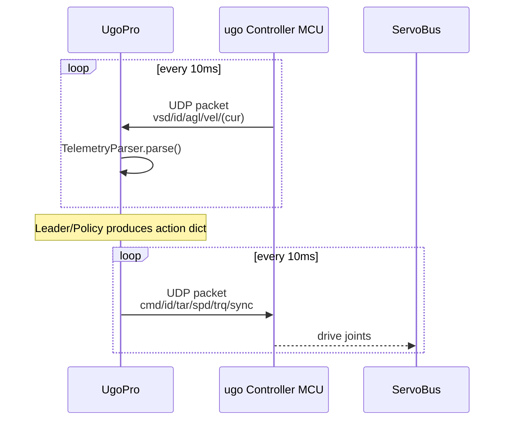

## 3. 全体アーキテクチャ

- **物理構成**: ugo Controller MCU ↔ RS-485 バス（Feetech/Robotis 混在） ↔ サーボ群。PC とは Ethernet で双方向 UDP。フォロワーロボットは teleoperator（leader）や記録済みデータからの関節目標を受け取り、MCU へ中継する。
- **ソフト構成**: 新規パッケージ `lerobot_robot_ugo_pro`（BYOH の命名規約に沿う）内に `UgoPro` クラスを実装し、`lerobot` の `Robot` リストへ登録。テレメトリ解析・UDP 送受信・フォロワーロジックをサブモジュールへ分割。
- **通信経路**:
  - MCU → PC: `ugo_arm_monitoring_spec.md` に従った CSV テキストを 10 ms 周期で受信、`TelemetryParser` で構造化。
  - PC → MCU: `cmd`/`tar`/`spd`/`trq` 行を生成して UDP 送信。フォロワー用に左右腕の行動を同一パケットにまとめる。
- **LeRobot 連携**: `UgoProConfig` でネットワーク設定・ジョイントマップ・安全限界を表現。`UgoPro` が `Robot` インターフェイス (`connect`, `disconnect`, `get_observation`, `send_action`, `is_calibrated`, `calibrate`, `configure`) を満たし、`lerobot-teleop`/`lerobot-record`/`lerobot-train` から利用できる状態にする。

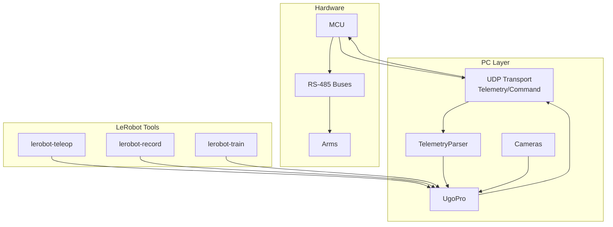

## 4. モジュール構成とパッケージング規約

BYOH の 4 つのコアコンベンションに従い、以下のレイアウトで Python パッケージを構築する。`__init__.py` で Config/Robot を再エクスポートし、`pyproject.toml` には `lerobot>=0.4.0` などの依存を明記する。

```
lerobot_robot_ugo_pro/
├── pyproject.toml / README.md / LICENSE
└── src/lerobot_robot_ugo_pro/
    ├── __init__.py                         # UgoProConfig / UgoPro を公開
    ├── config_ugo_pro.py                   # UgoProConfig, ArmJointMap dataclass
    ├── ugo_pro.py                          # Robot 実装
    ├── transport/
    │   ├── __init__.py
    │   ├── udp_client.py                   # UgoTelemetryClient, UgoCommandClient
    │   └── rate_limit.py                   # 10 ms 周期制御用
    ├── telemetry/
    │   ├── __init__.py
    │   ├── frame.py                        # TelemetryFrame dataclass
    │   └── parser.py                       # CSV パーサ + JointStateBuffer
    ├── follower/
    │   ├── __init__.py
    │   └── mapper.py                       # Leader からの action を ID 列へ展開
    └── tests/
        ├── test_parser.py
        ├── test_udp_client.py
        ├── test_robot_features.py
        └── fixtures/udp_samples.csv
```

将来的に teleoperator プラグイン（例: `lerobot_teleoperator_ugo_pro_leader`）を追加する場合も同じ命名規約を適用する。

`pyproject.toml` では以下を最低限定義する:

- `project.name = "lerobot_robot_ugo_pro"`（BYOH 規約の接頭辞）
- `project.entry-points."lerobot.robots" = { ugo_pro = "lerobot_robot_ugo_pro:UgoPro" }`
- `dependencies = ["lerobot>=0.4.0", ...]`

`lerobot-teleoperate` などは上記 entry point を経由して `UgoPro` を import しに来るため、Config/Robot を `__init__.py` で re-export することが必須。

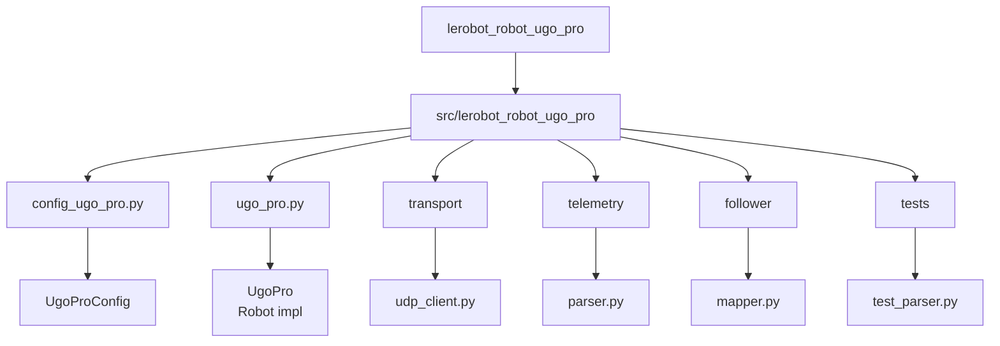

## 5. 主要コンポーネント設計

### 5.1 UgoProConfig

- `RobotConfig` を継承し `@RobotConfig.register_subclass("lerobot_robot_ugo_pro")` で登録。`Robot.name` は `ugo_pro` を予定。
- 主なフィールド:
  - `telemetry_host` (default `"0.0.0.0"`), `telemetry_port` (default `8886`)
  - `mcu_host` (`"192.168.4.40"`), `command_port` (`8888`)
  - `network_interface`（UDP bind NIC）、`timeout_sec`（デフォルト 0.3）
  - `left_arm_ids` / `right_arm_ids`（既定 `[11,12,13,14,15,16,17]` / `[1,2,3,4,5,6,7]`）
  - `joint_limits_deg`（各 ID の min/max）、`velocity_limit_raw`, `torque_limit_raw`
  - `follower_gain`（leader 追従の混合係数）、`mirror_mode`（左右入れ替え）
  - `cameras: dict[str, CameraConfig]`（必要に応じて RGB, Depth 等）
  - `extra_streams`（例: 力覚や電流を teleop に返す際のフィルタ設定）
- Config 内で UDP パラメータのバリデーション（ポート範囲、IP 形式）、Joint ID リスト重複チェック、limits との整合性を行う。`lerobot-robot-xarm` と同様、`Config` 側で toggle 可能な観測項目フラグ（`expose_velocity`, `expose_current`, `expose_target`）を設けると CLI 設定が容易。
- `RobotConfig` 基底実装（`refs/lerobot/src/lerobot/robots/config.py`）はカメラ解像度/FPS の指定を必須化しているため、`cameras` を使う場合は `width/height/fps` を Config 初期値で必ず埋める。

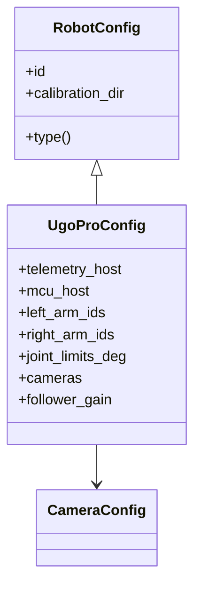

### 5.2 TelemetryParser & JointStateBuffer

- 入力: `bytes` で届く UDP ペイロード。行単位の CSV を解析し、`vsd`, `id`, `agl`, `vel`, `cur`, `onj_agl` を辞書化。
- 仕様準拠:
  - `id` 行受信までは `JointStateBuffer` を初期化しない。
  - 角度は `value / 10.0` で度へ変換し、`joint_map[id].angle_deg` として格納。
  - `vel` と `cur` はそのまま生データで保持するが、`Config.velocity_scale`/`torque_scale` が設定されていれば換算して `Observation` に含める。
  - `onj_agl` は最新コマンドとの突き合わせに利用する（フィードバック制御や遅延検知）。
  - `TelemetryFrame` には `timestamp`, `packet_age_ms`, `vsd_interval_ms`, `left_arm`, `right_arm`, `raw_lines`, `missing_fields`.
  - 欠損時は `NaN` をセットし `frame.health` に理由を記録。`ugo_arm_monitor.py` の `partial_buf` ロジックを移植して UDP パケット分割にも耐える。
- `JointStateBuffer` は最新 `TelemetryFrame` を原子的に更新し、`Robot` からは非同期ロックで参照できるようにする。

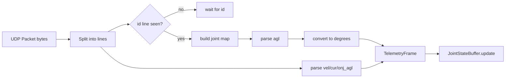

### 5.3 UDPTransport

- `UgoTelemetryClient`: `asyncio` ベースで `telemetry_port` にバインドし、受信パケット毎に `TelemetryParser.parse()` を呼び出す。`timeout_sec` を超えたら `ConnectionLost` コールバックを発火。
- `UgoCommandClient`: 送信 API `send_joint_targets(joint_deg: Dict[int, float], velocity_raw: Optional[Dict[int,int]], torque_raw: Optional[Dict[int,int]], mode: str = "abs")` を公開。処理内容:
  1. `joint_deg` を 0.1 度単位へ丸め (`round(value * 10)`)、`tar` 行を生成。
  2. `Config` の `left_arm_ids + right_arm_ids` に従い列順を固定し、長さ不一致の場合は `TelemetryParser.latest_ids` を参照して補完。
  3. `spd`/`trq` 行は Config の上限値や leader から渡された値を `[id 順]` で整列させ、未指定は空欄にする。
  4. `cmd` 行には `interval`/`write` を `vsd` からの実測値で更新し、`mode` は `abs` を基本、フェイルセーフ時は `hold` を指定。
  5. UDP ソケットは `SO_REUSEADDR`/`SO_BROADCAST`（必要なら）をセットし、双方向通信を阻害しないよう送信ポートを固定 (`8886`)。
- 送信周期は 10 ms に合わせ `RateLimiter` で制御。`lerobot-robot-xarm` が関節角を SDK へ投げる前に辞書を正規化しているのと同様に、`UgoCommandClient` でも欠けたジョイントを前回値で埋める。

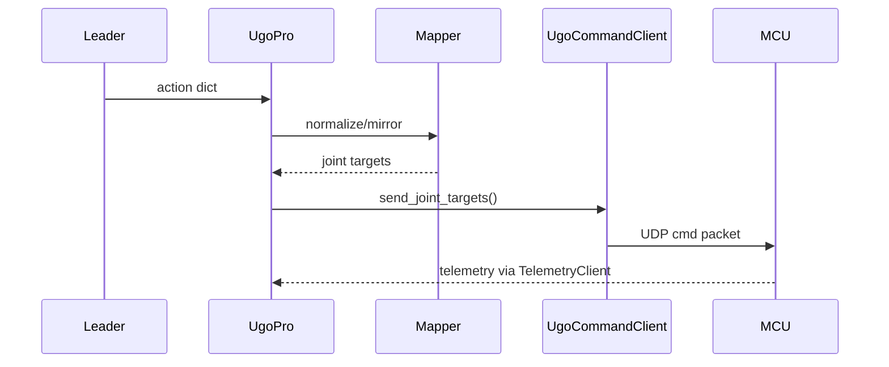

### 5.4 UgoPro (Robot)

- `config_class = UgoProConfig`, `name = "ugo_pro"`.
- **Observation features**（未接続時でも計算可能）:
  - `joint_<id>.pos_deg`: `float`（14 主要関節）
  - `joint_<id>.vel_raw` / `joint_<id>.cur_raw`（Config で有効化）
  - `joint_<id>.target_deg`（`onj_agl` を露出する場合）
  - `packet_age_ms`, `vsd_interval_ms`, `vsd_read_ms`, `vsd_write_ms`
  - `status.missing_fields`（`int`）、`status.health`（`str`）
  - カメラ: `(height, width, channels)` タプルを返す（BYOH ガイドのカメラ実装パターン）
- **Action features**:
  - `joint_<id>.target_deg`（degree 単位、`send_action` 内で 0.1 度へ変換）
  - `joint_<id>.velocity_raw` / `torque_raw`
  - `mode`（`str`、`abs`/`rel`/`hold`）
- **connect**:
  1. `UgoTelemetryClient` を起動し `id` 行を待機。
  2. `UgoCommandClient` を初期化し、双方向 UDP を確立。
  3. Config に定義されたカメラがあれば `make_cameras_from_configs` で接続（`lerobot-robot-xarm` の実装を踏襲）。
  4. `calibrate()` / `configure()` を呼び出し（後述）、フォロワーモード用の leader マッパを初期化。
  5. 既に接続済みで `connect()` が再度呼ばれた場合は `DeviceAlreadyConnectedError` を投げる（`xarm.py` と同じガード）。
- **disconnect**: 受信ループ → 送信ソケット → カメラの順で停止。`lerobot-robot-xarm` と同じく多重呼び出しを許容する。
- **calibrate / configure**:
  - MCU 側で提供されているホームポーズがないため、初回接続時にテレメトリ角を保存して `calibration_offsets` を 0 とみなす。今後 MCU 側のキャリブレーション API が提供されたらここで UDP コマンドを送る。
  - `configure` では `TelemetryParser.latest_frame` を参照し、`vsd_interval` と Config の制御周期が乖離していないか検証。フォロワーの `mirror_mode` や `follower_gain` を `follower.mapper` に反映する。
  - `Robot` 基底クラスの `_save_calibration()` / `_load_calibration()` を呼び出し、`HF_LEROBOT_CALIBRATION/robots/ugo_pro/<id>.json` に最新値を保存する。
- **get_observation**:
  - 最新 `TelemetryFrame` を `RobotObservation` 辞書へ変換し、`lerobot` CLI から参照できるキー名（`joint_11.pos_deg` など）を返す。
  - 欠損検知・タイムスタンプ差分を `status` フィールドに含める。
- **send_action**:
  - 入力は leader（例: `lerobot-teleoperator-teleop`）からの `dict[str, Any]`。
  - `follower.mapper` が `joint_<id>.target_deg` を合成（例: leader 片腕 → 左右へ同報、あるいは recorded dataset → そのまま)。
  - Joint limit を degree 単位でクリップし、0.1 度単位に丸めて `UgoCommandClient` へ渡す。
  - `mode` が `hold` であれば `tar` 行を前回値で維持したまま送信し、安全停止を MCU に依頼。
  - 辞書を `copy.deepcopy` してから整形し、呼び出し元の action を破壊しない（`xarm.py` での実装と同様）。
  - 送信エラーや MCU からの応答欠損は `DeviceNotConnectedError` を発生させ、Teleoperator へ通知する。

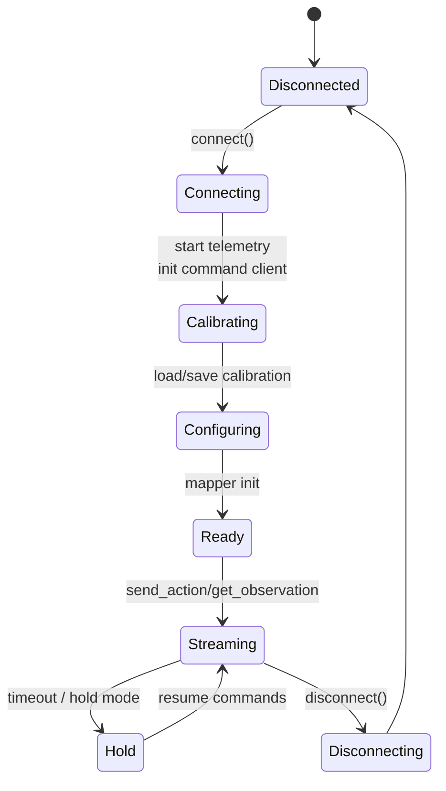

### 5.5 Teleoperator / Follower ブリッジ

- フォロワーモードでは `lerobot-teleop` CLI で指定された teleoperator（例: `lerobot_teleoperator_teleop` の leader arm）からのアクション辞書を `UgoPro` の `send_action` へそのまま受け渡す。
- `follower/mapper.py` では以下を担当:
  - Leader 関節名（例: `leader_joint_1.pos`）→ UgoPro ID（`joint_11.target_deg`）へのマッピング。Config で任意に定義できるようにする。
  - `mirror_mode=True` の際は左右 ID を入れ替え、符号を反転させる。
  - フォロワーゲイン `α` を用いた平滑化: `target = α * leader + (1-α) * current`.
  - Teleoperator からの `home`/`freeze`/`teach` コマンドを `mode`/`spd`/`trq` 行へ反映。
- 追加で力覚/電流フィードバックを teleoperator へ返す場合、`TelemetryFrame` の `cur` 行を低レイテンシでブロードキャストする軽量 API を設計する。

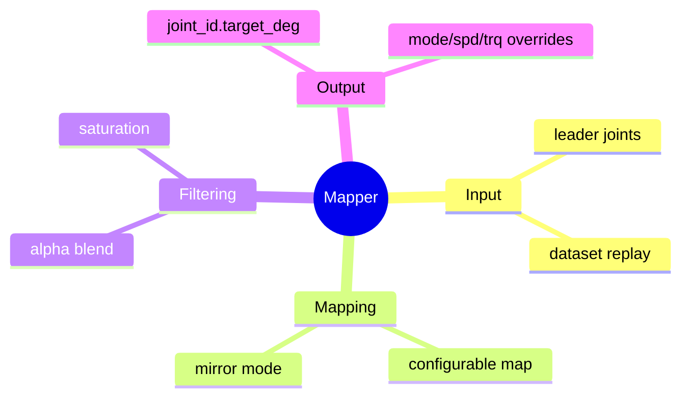

### 5.6 Observation / Action スキーマ

`custom_robot_integration_with_lerobot.md` で強調されているように、`observation_features` と `action_features` は接続前でも静的に評価できる辞書を返す必要がある。`ugo_arm_monitoring_spec.md` のテレメトリ構造をもとに、以下のキーセットを採用する。

| 観測キー | 型 | 取得元 / 備考 |
| --- | --- | --- |
| `joint_<id>.pos_deg` | `float` | `agl` 行を 0.1 度→度に換算（14 関節） |
| `joint_<id>.vel_raw` | `float` | `vel` 行の生値（`config.expose_velocity=True` のとき） |
| `joint_<id>.cur_raw` | `float` | `cur` 行。`torque_scale` 指定時は A/Nm へ換算 |
| `joint_<id>.target_deg` | `float` | `onj_agl` 行。欠損時は `NaN` |
| `packet_age_ms` | `float` | `TelemetryFrame.timestamp` と現在時刻差分 |
| `vsd_interval_ms`, `vsd_read_ms`, `vsd_write_ms` | `float` | `vsd` 行のメタ情報 |
| `status.health` | `str` | `ok` / `stale` / `missing_id` など |
| `status.missing_fields` | `int` | 欠損行数 |
| `camera_<name>` | `(H, W, 3)` など | Config の `CameraConfig` から shape を決定 |

`action_features` は MCU CSV の `tar/spd/trq/mode` に一致させる。

| アクションキー | 型 | 送信内容 |
| --- | --- | --- |
| `joint_<id>.target_deg` | `float` | 絶対角度（度）。`send_action` 内で 0.1 度整数化 |
| `joint_<id>.velocity_raw` | `float` | raw 速度上限。省略可 |
| `joint_<id>.torque_raw` | `float` | raw トルク上限。省略可 |
| `mode` | `str` | `abs` / `rel` / `hold` |
| `teleop.meta.timestamp` | `float` | Leader 側のタイムスタンプ（`sync` 行へ転記） |

`observation_features`/`action_features` の辞書自体は `UgoProConfig` を参照して生成し、xArm 実装と同じくクラスプロパティで即時に構築しておく。

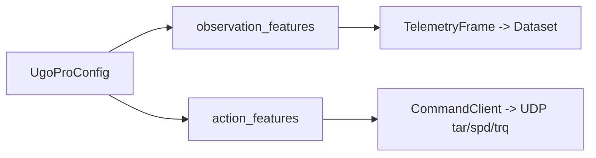

## 6. フォロワーモード仕様

- **優先度 1 – 既存バイラテラル HW との有線制御**: 既に存在する外部 teleoperator（デュアルアーム・バイラテラルコントローラ）が `ugo Controller MCU` と有線接続し、従来通り MCU 経由で ugo Pro を制御できることを最優先する。この構成では MCU からの UDP テレメトリ（`docs/ugo_arm_monitoring_spec.md`）をそのまま LeRobot 側で受信し、`lerobot-record` などで動作データを記録できるため、フォロワー実装は「テレメトリを破壊せずに横取りして保存する」ことに徹する。
- **優先度 2 – LeRobot Teleoperator 互換**: 上記を満たした後に、`lerobot` 標準 teleoperator（`keyboard_ee`, XR デバイス等）からの action 辞書を `UgoFollowerMapper` で左右対応・mirror・follower gain を反映しつつ `mode:home/hold` にも対応させる。これにより既存 HW が無い拠点でも LeRobot CLI だけで操作・記録が可能になる。
- **同期**: Leader から 60 Hz で受け取る指令を 10 ms 単位の送信スロットへ整列。指令遅延が 20 ms を超える場合は `mode:hold` を自動挿入。
- **左右腕サポート**: Config の `follower_role`（`"dual" | "left-only" | "right-only"`）を参照し、不要な腕は `tar` を前回値で保持。`Teleoperator` が片腕しか持たないケースでも `id` 行の並びを維持する。
- **安全停止**: `timeout_sec` を超えたら `send_action` から `mode:hold` を送信し、`tar` を最後の安全姿勢（例: 中立 0 deg）へ補間。
- **記録モード**: `lerobot-record` から `UgoPro` を呼び出した場合は、`TelemetryFrame` + 送信 `tar` を dataset に記録し、模倣学習用データセットを生成できるよう `Observation` に `cmd_history` を含める。

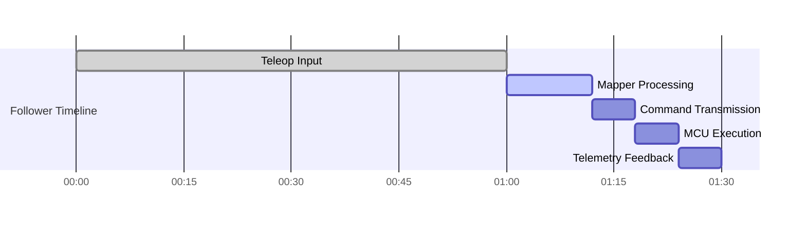

## 7. データフロー

1. `connect()` → TelemetryClient/CommandClient/Cameras 起動 → `id` 行受信で Joint Map 確定。
2. `TelemetryParser` がパケットを `TelemetryFrame` に変換し、`JointStateBuffer` に保存。
3. Leader/Policy が `send_action()` へ辞書を渡す → `follower.mapper` が 14 関節分の `joint_<id>.target_deg` を生成 → `UgoCommandClient` が UDP 送信。
4. MCU がサーボを駆動し、次周期のテレメトリが PC へ戻る。
5. `get_observation()` を呼ぶたびに最新 `TelemetryFrame` を `Observation` 辞書へ整形して返す。リーダーにもフィードバックを送る場合は別途 Pub/Sub を用意。

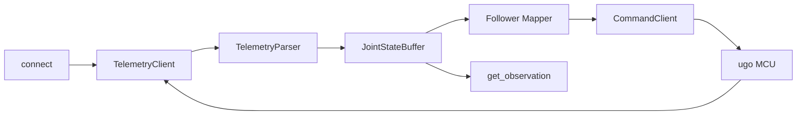

## 8. エラーハンドリングと安全性

- **タイムアウト/欠損**: `TelemetryClient` が `timeout_sec` 以内にパケットを受信できなければ Robot 側で `DeviceNotConnectedError` を投げ、`mode:hold` を送信。`status.health` に `stale` 等の文字列を保存。
- **値検証**: `joint_limits_deg` を超える観測はログ警告を出し、`Observation` ではクリップ or `NaN` にする。送信時も limit を再確認する。
- **再接続**: UDP ソケット障害や NIC リセット時にリトライを実装。`lerobot-robot-xarm` 同様 `is_connected` プロパティを真偽値で公開し、複数回 `connect` されないようガードする。
- **ログ/メトリクス**: `structlog` で `event`, `joint_id`, `latency_ms`, `packet_age_ms` を記録。`TelemetryFrame.health` を Prometheus などへエクスポート可能な hook を用意。

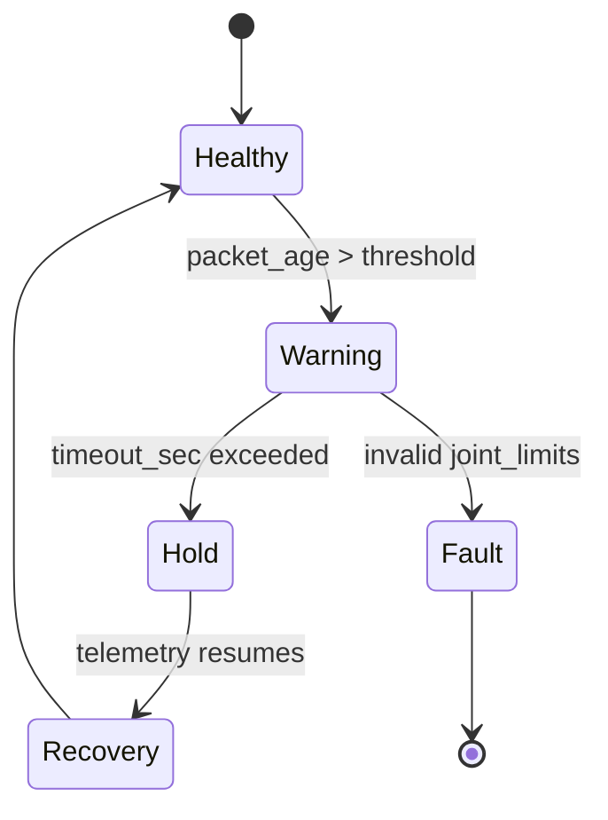

## 9. 依存関係と互換性

- ランタイム依存: `lerobot`, `numpy`, `pydantic` or `pydantic-core`（Config バリデーション）、`asyncio` 標準ライブラリ、`structlog`（任意）、`opencv-python`（カメラ運用時）。
- テスト依存: `pytest`, `pytest-asyncio`, `pytest-mock`.
- Python 3.10+（LeRobot 本体と整合）。`pyproject` の `project.entry-points."lerobot.robots"` に `lerobot_robot_ugo_pro = "lerobot_robot_ugo_pro:UgoPro"` を登録して BYOH 規約を満たす。

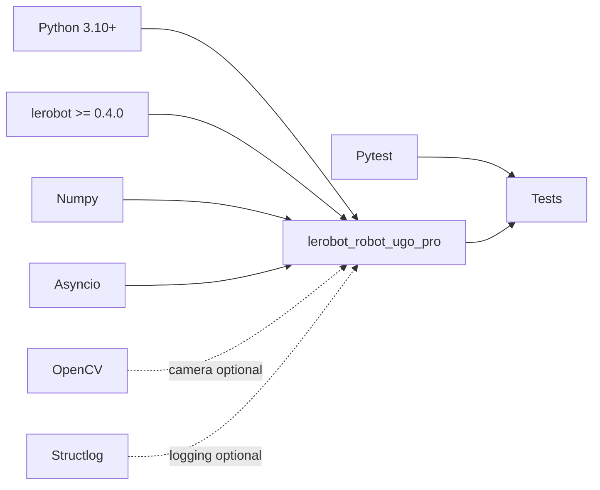

## 10. 開発・テスト戦略

- **単体テスト**: `telemetry/test_parser.py` で `ugo_arm_monitoring_spec.md` のサンプル行を用いたパース試験、`transport/test_udp_client.py` で `asyncio.DatagramEndpoint` をモックしコマンド生成を検証。
- **統合テスト**: `tests/test_robot_features.py` で `UgoPro.observation_features`/`action_features` が Config から決まることを確認。`lerobot-robot-xarm` で用いられている `DeviceNotConnectedError` ハンドリングを流用し、接続状態テストを追加。
- **HIL（Hardware-In-the-Loop）**: 実機 ugo_pro とネットワーク直結し、以下を記録。
  1. 接続から初回テレメトリ取得までの時間
  2. `send_action -> telemetry round-trip` の遅延
  3. Leader 操作から follower 動作までの追従誤差
- **CI**: GitHub Actions で lint（ruff/mypy）、pytest（async 含む）、`pyproject` パッケージビルドを自動化。UDP テストはモックサーバで行い、CI 上ではネットワーク依存を排除。

## 11. オープン事項

1. `cur` 行の単位（電流 or トルク）とスケーリング係数が未確定。実測して `Observation` の単位（A, Nm）を定義する。
2. Leader ↔ follower の同期方式（timestamp か sequence number か）を決定し、`sync` 行へどの情報を載せるか MCU チームと合意する。
3. Teleoperator へのフィードバックチャンネル（力覚/電流/VSD メタ情報）をどの頻度・フォーマットで送るか運用チームと詰める。

以上の設計を基に、`lerobot_robot_ugo_pro` パッケージとしてフォロワーロボット実装を進める。
